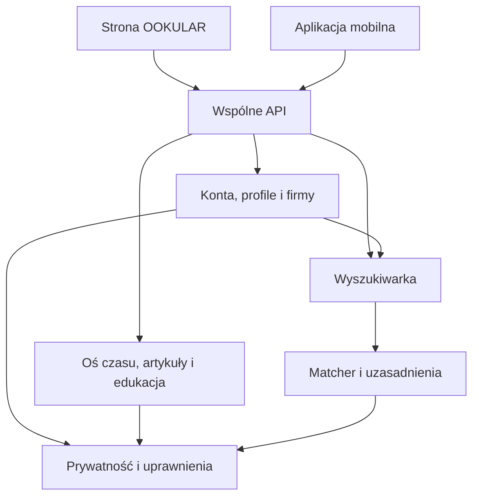

# OOKULAR — mapa bloków v0.3

**Jeden backend Django, wspólna baza PostgreSQL, dwa interfejsy: web i mobile.**
To modularny monolit: moduły mają oddzielne odpowiedzialności w jednym projekcie,
a nie oddzielne serwery. Ten podział jest decyzją projektową dla pierwszej wersji OOKULAR.

Schemat pokazuje współpracę bloków, nie kolejność wszystkich zapytań HTTP.
Prywatność i uprawnienia kontrolują odczyt przed wyszukiwaniem i dopasowaniem.

| Moduł w Django | Blok | Stan v0.3 | Odpowiedzialność |
|---|---|---|---|
| `core` | Fundament | Fundament | Konfiguracja, diagnostyka działania, wspólne API i katalog modułów. |
| `accounts` | Konta i role | Wdrożony w kodzie | Rejestracja obu ról, potwierdzanie e-mail, logowanie, reset hasła, sesje web i mobilne. |
| `taxonomy` | Słowniki i kryteria | Zaplanowany | Wersjonowane słowniki umiejętności, uprawnień i warunków pracy; oddzielenie informacji prywatnych od kryteriów zawodowych. |
| `profiles` | Kreator profilu pracownika | Częściowo wdrożony | Prywatny szkic podstaw i celu zawodowego; zapis i wznowienie w web/API. Dalsze kroki, tagi, suwaki i publikacja pozostają planem. |
| `organizations` | Firmy i członkostwa | Zaplanowany | Profil firmy, weryfikacja oraz członkostwa i uprawnienia rekruterów. Rola pracodawcy nie daje automatycznie dostępu do każdej firmy. |
| `jobs` | Oferty i aplikacje | Zaplanowany | Wymagania stanowiska, warunki zatrudnienia i zgłoszenia kandydatów. |
| `feed` | Oś czasu i ogłoszenia | Zaplanowany | Publiczna oś czasu, zwykłe wpisy i ogłoszenia. Widoczność, publikacja i moderacja; promowanie uruchamiane przez billing. |
| `content` | Artykuły branżowe | Zaplanowany | Treści redakcyjne, kategorie, autorzy i publikacja artykułów dostępnych bez konta. |
| `education` | Edukacja | Zaplanowany | Katalog materiałów i ofert edukacyjnych oraz ewidencja prowizji po ustaleniu modelu rozliczeń. |
| `search` | Wyszukiwarka | Zaplanowany | Frazy, filtry i paginacja; następnie semantyka. Pobiera tylko dozwoloną, opublikowaną projekcję zawodową. |
| `matching` | Silnik dopasowania | Zaplanowany | Własne, wersjonowane reguły dopasowania do stanowiska, uzasadnienia i brak danych. Bez arbitralnego wyniku ani oceny wartości człowieka. |
| `social` | Relacje i reakcje | Zaplanowany | Obserwowanie, zaproszenia, blokady i reakcje. Zasady ocen i weryfikacji wymagają osobnej implementacji. |
| `messaging` | Wiadomości | Zaplanowany | Rozmowy i uczestnicy; dostęp wyłącznie do własnych rozmów. Blokady i zgłoszenia. |
| `notifications` | Powiadomienia | Zaplanowany | Preferencje i dostarczanie powiadomień w aplikacji, e-mailem oraz push. |
| `billing` | Punkty, BLIK i rozliczenia | Zaplanowany | Portfel punktów i dziennik operacji; potwierdzenia płatności, zwroty, idempotencja i promocje. Dostawca niepodłączony. |
| `moderation` | Moderacja i zgłoszenia | Zaplanowany | Decyzje moderatorów, zgłoszenia i audyt. Podstawowe zasady dostępu obowiązują od pierwszych funkcji. |
| `privacy` | Prywatność i widoczność | Zaplanowany | Cele użycia danych, zakresy widoczności, eksport i usuwanie oraz projekcja informacji dopuszczonych do dopasowania. |
| `integrations` | Integracje zewnętrzne | Zaplanowany | Adaptery usług AI, poczty, push i płatności. Klucze tylko po stronie serwera; brak zewnętrznych wywołań w szkielecie. |

„Fundament” oznacza działającą część techniczną opisaną w README.
„Zaplanowany” oznacza katalog Django i opis odpowiedzialności. Nie oznacza działającej funkcji.
Moduły planowane nie rejestrują jeszcze endpointów.

## Granice, których pilnujemy

- **Konto ≠ profil.** Konto obsługuje logowanie. Rozbudowany portret człowieka należy do profili.
- **Rola ≠ uprawnienie do firmy.** Jedna osoba może być pracownikiem i pracodawcą. Dostęp do konkretnej firmy wymaga członkostwa w tej firmie.
- **Wpis ≠ oferta pracy.** Oś czasu może zawierać różne ogłoszenia. Oferta pracy ma własne wymagania, warunki i zgłoszenia.
- **Wyszukiwarka ≠ Matcher.** Pierwsza odnajduje kandydatów spełniających warunki, drugi wyjaśnia dopasowanie do konkretnego stanowiska.
- **Dane profilowe ≠ dane do dopasowania.** Do indeksu i Matchera trafia ograniczona projekcja zawodowa.
- **Płatność ≠ promocja.** Potwierdzone zdarzenie finansowe uruchamia promocję. Ponowne dostarczenie tego samego zdarzenia nie może naliczać punktów ponownie.

## Wymagania zachowane do kolejnych etapów

Profil ma uwzględniać fizyczność, doświadczenie, umiejętności, energię i umysł jako
koncepcyjne obszary opisu. Szczegółowy słownik pytań, zakres widoczności i dopuszczone
użycie każdego pola wymagają osobnej implementacji. Nie tworzymy automatycznie z tych
obszarów rankingów kandydatów.

„Szczęśliwa numeracja” identyfikatorów pozostaje wymaganiem kont. Ten techniczny szkielet
używa BigAutoField i zwraca ID jako nieprzezroczysty tekst. Regułę docelowych numerów
trzeba ustalić przed publicznym uruchomieniem i utrwaleniem produkcyjnej bazy; w tym etapie
nie ma produkcyjnych kont ani arbitralnego algorytmu numerologicznego.

Zasady opinii zachowujemy w planie: brak modułu negatywnych ocen ludzi, ewentualne
oceny gwiazdkowe dopiero po określeniu weryfikacji i uprawnień.
