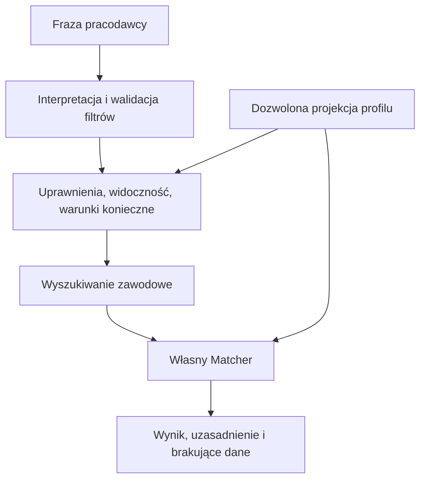

# API, wyszukiwarka i Matcher

## Działające endpointy fundamentu

| Metoda i adres | Dostęp | Wynik |
|---|---|---|
| GET /health/ | publiczny | Żywotność procesu: status ok. |
| GET /ready/ | publiczny | Możliwość odczytu bazy: 200 albo 503 bez szczegółów połączenia. |
| GET /api/v1/ | publiczny | Nazwa usługi, wersja API i etap foundation. |
| GET /api/v1/me/ | własna sesja i potwierdzony e-mail | Własne ID, e-mail i role. |
| GET/PATCH /api/v1/me/employee-profile/ | aktywne, zweryfikowane konto z rolą pracownika | Własny prywatny szkic; zapis wymaga aktualnej rewizji. |
| GET /api/v1/modules/ | aktywne konto staff z potwierdzonym e-mailem | Katalog domen i ich rzeczywisty stan realizacji. |
| /admin/ | administracja Django | Zarządzanie kontami i rolami. |

Kontrakt maszynowy: [OpenAPI](../contracts/openapi.json).
Klient TypeScript: [api-client](../packages/api-client/src/index.ts).

API domyślnie wymaga aktywnego konta z potwierdzonym e-mailem. Przeglądarka korzysta
z sesji Django i CSRF. Natywny klient korzysta z `X-Session-Token`; sprawdzane są
wygaśnięcie sesji, aktywność użytkownika i hash uwierzytelnienia po zmianie hasła.
Rejestracja i logowanie obu ról działają; wyszukiwanie pozostaje planem.
Adresy formularzy i przepływy `/api/auth/app/v1/` opisuje [blok kont](06-konta.md).

## Plan przetwarzania zapytania

Najpierw działa wyszukiwanie frazowe i filtry. W dalszym etapie PostgreSQL Full Text Search
oraz pgvector mogą wspierać wyszukiwanie znaczeniowe.
pgvector zapewnia operacje podobieństwa wektorów w PostgreSQL; nie zastępuje reguł
kwalifikowania profili ani uprawnień. [Dokumentacja pgvector](https://github.com/pgvector/pgvector)

AI może tłumaczyć zdanie na dozwolone, sprawdzalne filtry. Interpretacja będzie widoczna
dla pracodawcy i możliwa do poprawienia. Własny silnik odpowiada za reguły wyniku.
Na tym etapie nie wybieramy arbitralnych wag, nie zwracamy pozornych procentów dopasowania
i nie wywołujemy żadnego modelu AI.

## Kontrakt Matchera do późniejszej implementacji

Wejście: wersja kryteriów, wymagania stanowiska, warunki pracy i dozwolona projekcja zawodowa.
Wyjście: spełnienie warunków koniecznych, uzasadnienie dla każdego użytego kryterium,
brakujące dane, wersja reguł oraz wynik tylko wtedy, gdy został zdefiniowany i zweryfikowany.

Niepełny profil wymaga oznaczenia braków. Nie wolno bez uzasadnienia zamieniać braku
odpowiedzi w brak umiejętności ani nadawać mu domyślnie zera.

Dostęp pracodawcy jest sprawdzany przed odczytem profilu, a następnie przed wyświetleniem
wyniku. Prywatne dane, dane zdrowotne, treść rozmów i nieopublikowane odpowiedzi kreatora
nie trafiają do indeksu ani embeddingów. Zmiana widoczności musi usuwać nieaktualne dane
z indeksów, pamięci podręcznej i wyników.

## Wspólne dane web/mobile

Konta i aktualny szkic podstaw profilu są przechowywane na serwerze. Web i mobile
korzystają z tego samego szkicu. Kontrola rewizji odrzuca starszy zapis kodem 409;
nie stanowi historii wersji do przywrócenia. Historia i kolejne kroki kreatora
pozostają planem. Szczegóły: [podstawowy profil](08-profil-pracownika.md).
Klucze OpenAI i innych dostawców pozostają wyłącznie w backendzie.
[OpenAI: uwierzytelnianie API](https://developers.openai.com/api/reference/overview)
